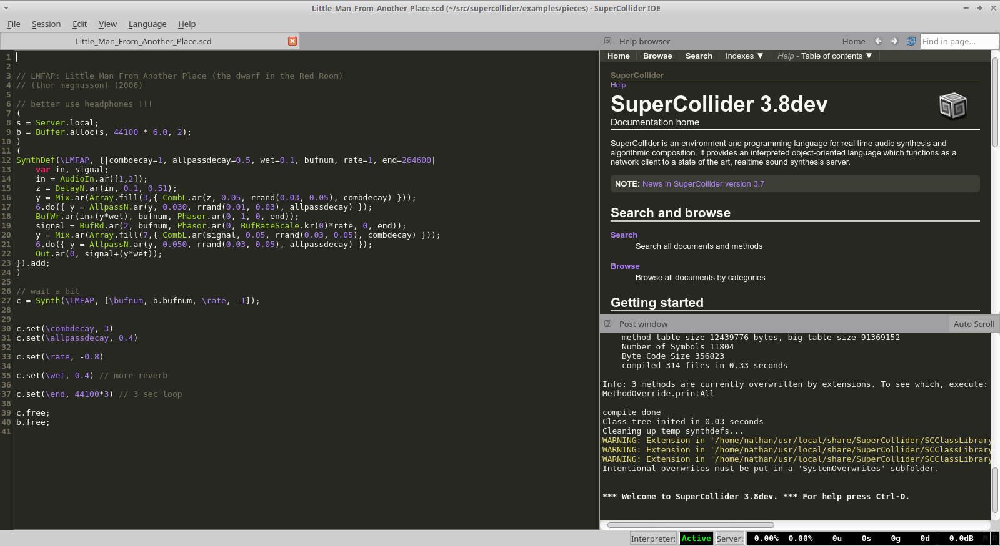

The [Monokai](http://www.monokai.nl/blog/2006/07/15/textmate-color-theme/) TextMate theme adapted for SuperCollider IDE. Good for coding in dark venues :)

`sc_ide_conf.yaml` is for the editor. There is no easy way to install this; it has to be manually grafted into `Platform.userConfigDir +/+ "sc_ide_conf.yaml"`. It goes under IDE/editor.

`custom.css` is for the help files. It goes in `thisProcess.platform.userAppSupportDir +/+ "Help/custom.css"`.
